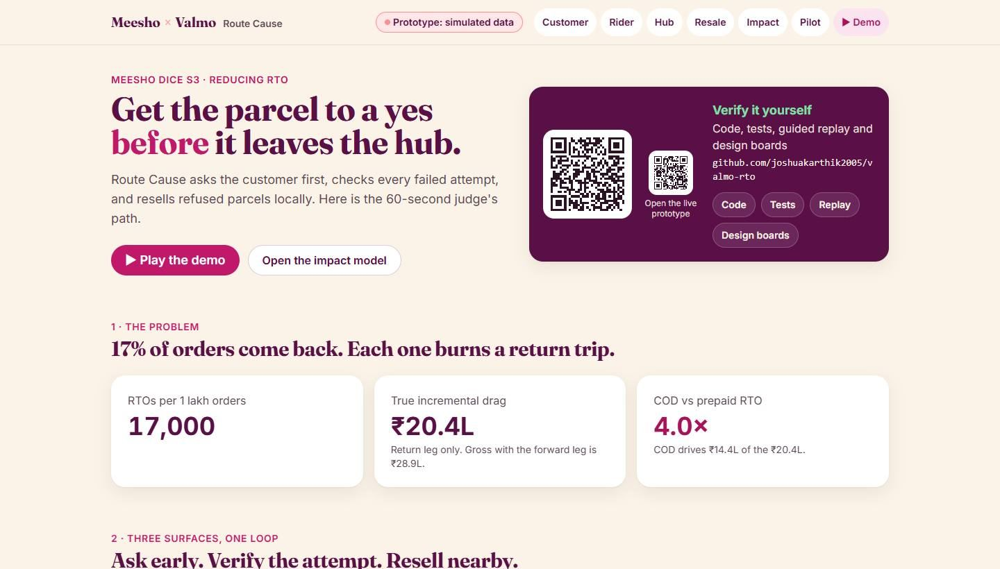
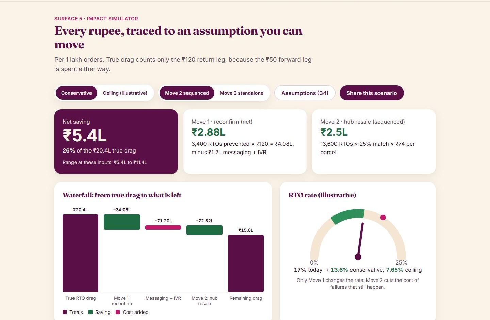
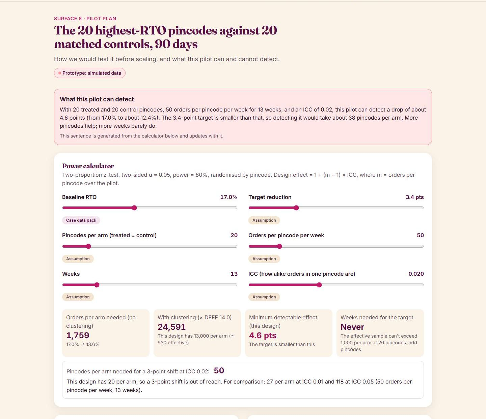
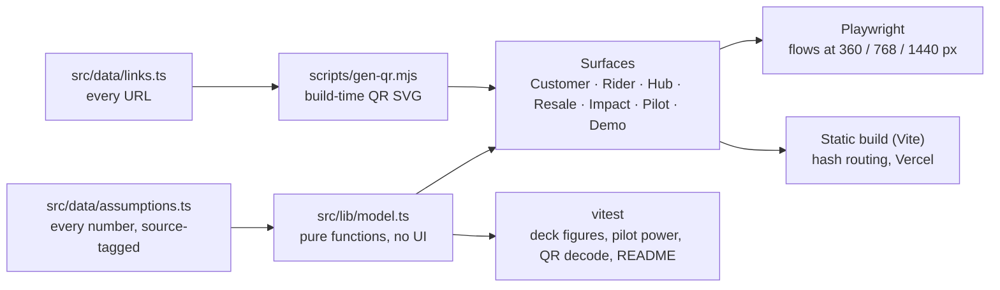

# Route Cause: reducing RTO for Valmo

An interactive prototype for **Meesho DICE Challenge S3 (Business Track): "Reducing RTO: Getting More Orders Delivered"**.

[](https://github.com/joshuakarthik2005/valmo-rto/actions/workflows/ci.yml)

**Live:** https://valmo-jet.vercel.app · **60-second path:** [valmo-jet.vercel.app/#/demo](https://valmo-jet.vercel.app/#/demo) (guided, captioned, about 2 minutes end to end)

> **Disclaimer.** This is a student team prototype and all data in it is simulated. It is not a Meesho or Valmo product, uses no official logo assets, and implies no integration with either company's systems. Customer, rider and seller names are fictional. Ceiling figures are illustrative, and the network-scale figure is an upper-bound illustration, not a forecast. Non-English message copy needs native-speaker review.

| Landing | Impact simulator | Pilot power calculator |
|---|---|---|
|  |  |  |

## Headline numbers (per 1 lakh orders, as `src/lib/model.ts` computes them)

| | Value |
|---|---|
| Blended RTO (80% COD × 20% + 20% prepaid × 5%) | **17%** = 17,000 RTOs |
| True incremental drag (₹120 return leg only; the ₹50 forward leg is spent either way) | **₹20.4L** (₹28.9L gross) |
| COD vs prepaid RTO | **4.0×** |
| Move 1, reconfirmation (net of ₹1.2L messaging + IVR) | **₹2.88L** conservative, **₹10.02L** ceiling |
| Move 2, hub resale, sequenced after Move 1 (₹74 net per resold parcel) | **₹2.5L** conservative, **₹1.4L** ceiling |
| Combined | **₹5.4L–₹11.4L** net = **26%–56%** of the true drag |
| Illustrative RTO after Move 1 (Move 2 doesn't change the rate) | 17% → **13.6%** conservative, **7.65%** ceiling |
| COD → UPI switch | **₹18** expected saving per switch: **−₹2** net at a ₹20 discount, **+₹8** at ₹10 |
| Pilot: the 20 highest-RTO pincodes vs 20 matched controls, 50 orders/pincode/week, 13 weeks, ICC 0.02 | Detects a drop of about **4.6 points**. A 3-point shift would need about **50** pincodes per arm |
| Network scale (764M orders, FY25) | About **₹410–870 Cr/year**: an upper-bound illustration, **not a forecast** |

`tests/unit/readme.test.ts` checks every figure in this table against the model, so the README can't drift from the app.

## Assumptions and limits

- **Sources.** Every input lives in [`src/data/assumptions.ts`](src/data/assumptions.ts), tagged *Case data pack*, *Primary research (n=25, small)* or *Assumption*. The impact page's Assumptions drawer lists them all with their tags.
- **Small primary research.** The reply rates (40% "definitely", 30% "maybe") and the root-cause split come from 25 short interviews (20 shoppers). They are directional, not representative.
- **Planning assumptions, not measurements:** the intent-to-action haircut (50%), the resale match rate (25%), the messaging cost, the control-group size, the pilot ICC and the ₹15 rider attempt fee. The rider fee is a placeholder and feeds no headline number.
- **Per-case ceilings.** "Up to ₹170" (cancel before dispatch, "I didn't order this") is a per-case ceiling. It is never added to the Move 1 total.
- **What the pilot can detect.** With realistic clustering, the 20 + 20 pilot detects about a 4.6-point drop, not the 3.4-point conservative estimate. Measuring that needs more pincodes, not more weeks.
- **Still open:** GST treatment of a resold order's original invoice (flagged for Meesho finance), the hub invoicing workflow, seller consent for resale, native review of the Hinglish and Hindi copy, and the real rider rate card. See [`docs/audit/FINDINGS.md`](docs/audit/FINDINGS.md) for the evaluator's-eye audit and its status.

## How the code is put together



The decisions behind this layout are in [`docs/adr`](docs/adr).

## The six surfaces

| Surface | Route | Idea |
|---|---|---|
| Customer | `#/customer` | Reconfirmation ladder: T-48h WhatsApp/SMS, T-24h delivery window, T-2h IVR, then a hub call before dispatch. Replies: confirm, reschedule, cancel, "I didn't order this", switch COD to UPI. English, Hinglish and Hindi. |
| Rider | `#/rider` | Masked in-app calls and a call log validate "customer unavailable". No GPS. The OTP only confirms a successful delivery. |
| Hub | `#/hub` | Control tower: risk, nudge status, SLA timers, flagged attempt marks, resale shelf countdown. |
| Resale | `#/resale` | Refused parcel, eligibility check, nearby buyer match, auto invoice, next-day local delivery, or standard RTO after 5 business days. |
| Impact | `#/impact` | Live waterfall, sliders, assumptions drawer with source tags, sensitivity, RTO gauge, shareable URL. |
| Pilot | `#/pilot` | The 20 highest-RTO pincodes against 20 matched controls (the control size is an assumption), a cluster-aware power calculator, a 30-60-90 timeline, metric definitions and guardrails. |

## More

- 90-second walkthrough: [docs/DEMO_SCRIPT.md](docs/DEMO_SCRIPT.md)
- Test results: [docs/tests.md](docs/tests.md) · Quality gates: [docs/QUALITY.md](docs/QUALITY.md)
- Design boards: [docs/design](docs/design)
- The archived v1 prototype is at [`/legacy/`](legacy/index.html). It's superseded and kept unchanged for history; some of its figures were corrected in v2.

## Run, build, test

Requires Node 20 or later.

```bash
npm ci
npm run dev            # http://localhost:5173
npm run build          # QR codes, then type-check, then the static build in dist/
npm test               # vitest: model, QR decode and README figures
npm run test:e2e       # Playwright smoke test; uses your installed Chrome
npm run docs:tests -- --e2e   # regenerates docs/tests.md and docs/screens
node scripts/gen-qr.mjs --png # writes docs/qr-repo.png and docs/qr-live.png
```

Playwright uses `channel: 'chrome'`, so no browser download is needed. To test a deployed URL, run `BASE_URL=https://… npx playwright test`.

## Deploy

This is a static Vite build with hash routing, so no rewrites are needed. `vercel.json` sets the Vite framework, `npm run build` and the `dist` output. Merging to `main` deploys production.

## Stack

Vite, React 18, TypeScript, Tailwind CSS, framer-motion, vitest, Playwright, qrcode and jsqr. Charts are plain HTML/SVG. Fonts are self-hosted Inter and Fraunces (SIL OFL 1.1, licences in [`public/fonts/`](public/fonts)).

## Licence

Code: [MIT](LICENSE) © 2026 joshuakarthik2005. Bundled fonts keep their own SIL Open Font Licence. "Meesho" and "Valmo" are their owners' names, used here only to describe the challenge (see the disclaimer above).
