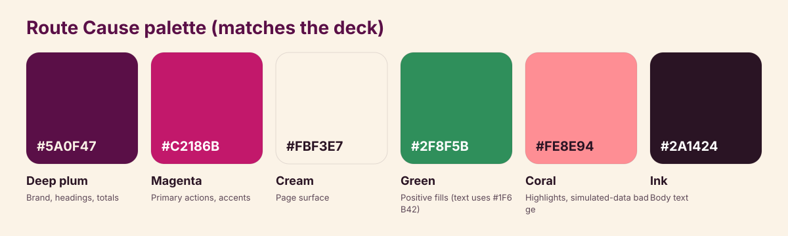
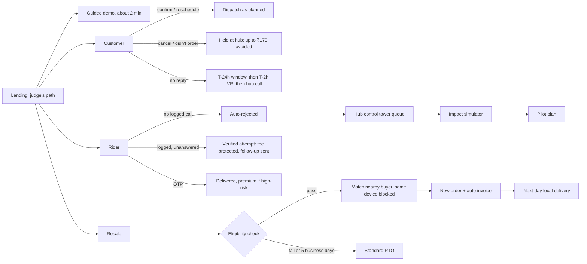
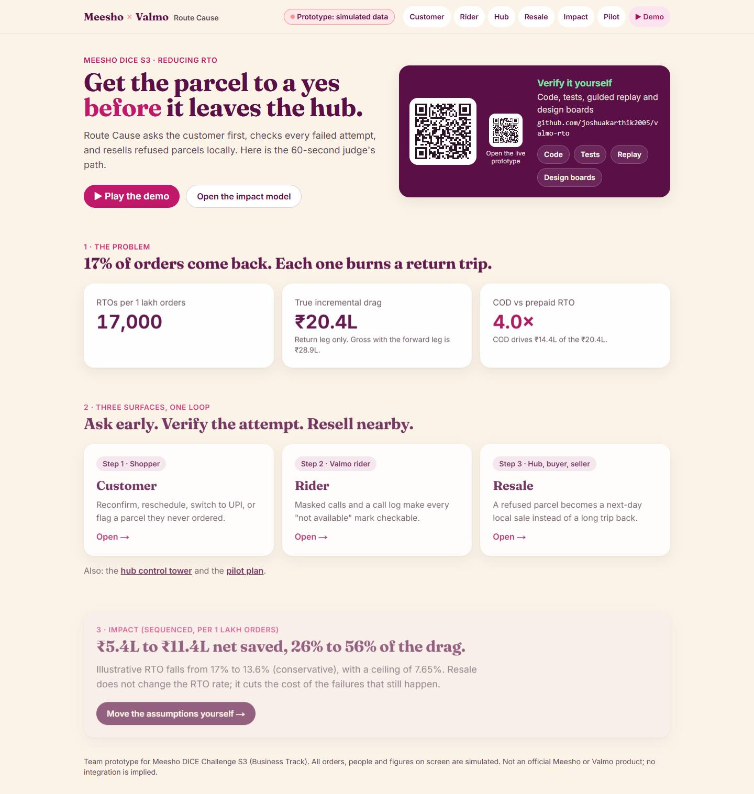
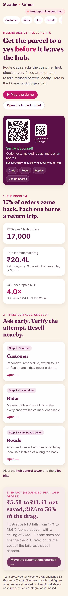
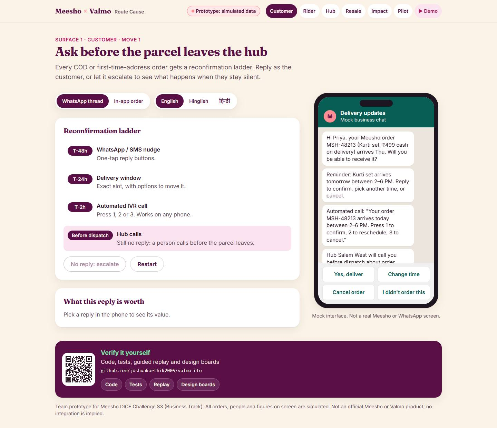
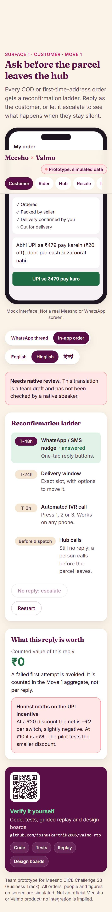
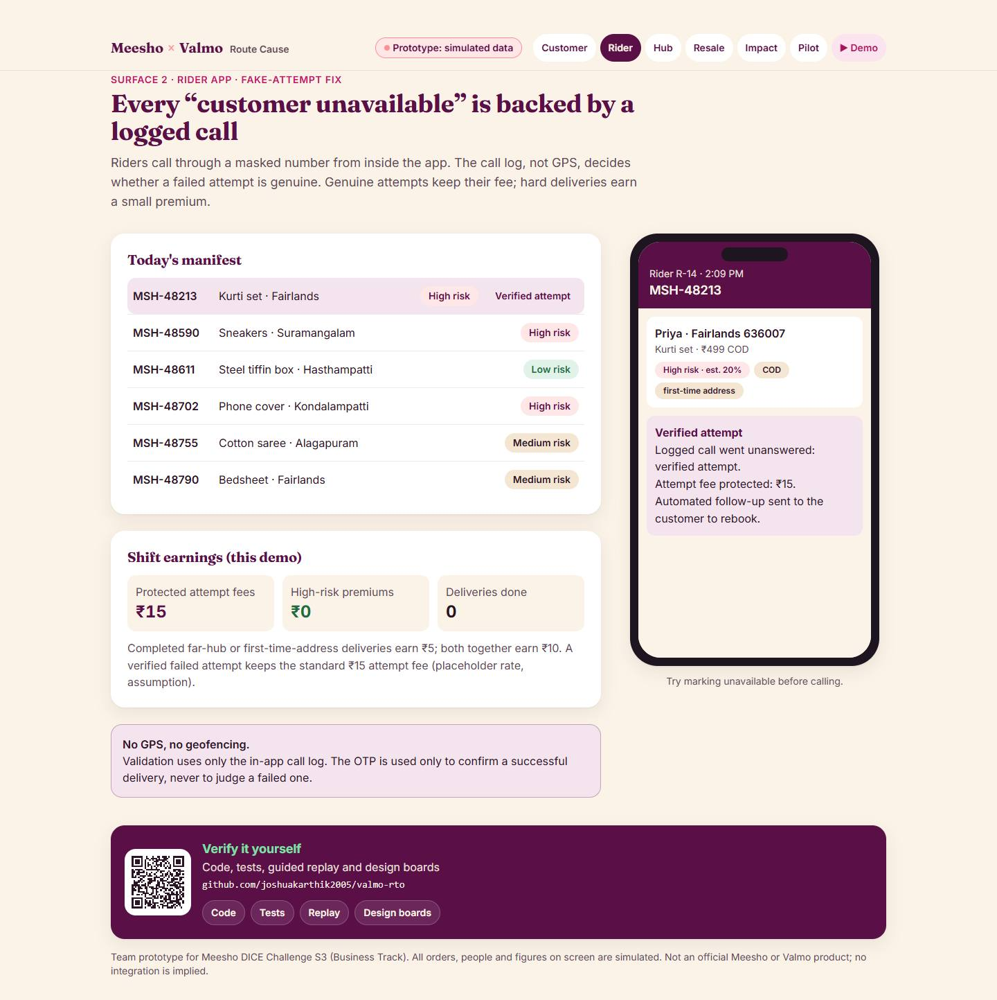
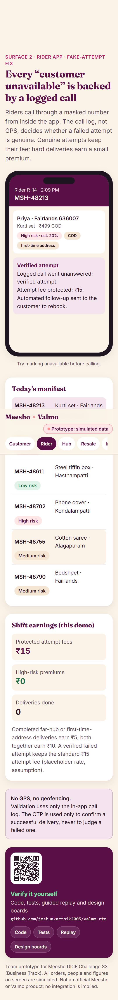
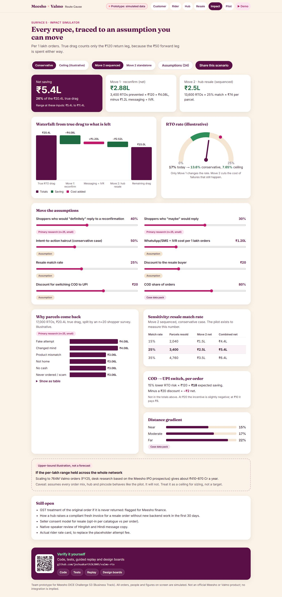
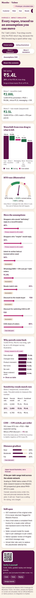

# Design boards

Route Cause is a prototype for Meesho DICE Challenge S3 (Business Track). Everything shown here uses simulated data. There are no official Meesho or Valmo logo assets, and no integration is implied.

## 1. Palette

| Token | Hex | Use |
|---|---|---|
| `plum` | `#5A0F47` | Brand, headings, totals, the Verify card |
| `magenta` | `#C2186B` | Primary buttons, eyebrows, focus ring |
| `cream` | `#FBF3E7` | Page surface |
| `leaf` | `#2F8F5B` | Positive fills. Text uses `leaf-700` `#1F6B42` to pass WCAG AA |
| `coral` | `#FE8E94` | Highlights and the "Prototype: simulated data" badge (always paired with ink text) |
| `ink` | `#2A1424` | Body text. `ink-soft` `#5C4756` for secondary text |

Type: Fraunces (display) and Inter (body), with body text at 16px or more and nothing below 13px. The Inter fallback is metric-matched so the font swaps in with no layout shift.

## 2. Components

| Component | File | Notes |
|---|---|---|
| Shell: wordmark, simulated badge, surface switcher, footer | `src/components/Shell.tsx` | Text-only wordmark, skip link, sticky header |
| Verify-it-yourself card | `src/components/VerifyCard.tsx` | The QR codes are generated at build time from `src/data/links.ts` |
| Phone frame | `src/components/Phone.tsx` | Used for the WhatsApp, in-app, rider and buyer mocks |
| Segmented control, Stat, Callout, SourcePill, PageHeader | `src/components/ui.tsx` | SourcePill tags every assumption with its source |
| Waterfall, gauge, assumptions drawer | `src/surfaces/Impact.tsx` | Plain HTML/SVG for speed; Recharts is used for the pilot time series |

Motion uses framer-motion, loaded lazily with the first interactive surface. It honours `prefers-reduced-motion` through `MotionConfig reducedMotion="user"` plus a CSS override.

## 3. Screen flows

## 4. Screens

Captured by the Playwright smoke test at 360, 768 and 1440 px. See [`../screens`](../screens).

| Desktop | Mobile |
|---|---|
|  |  |
|  |  |
|  |  |
|  |  |
